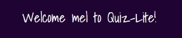
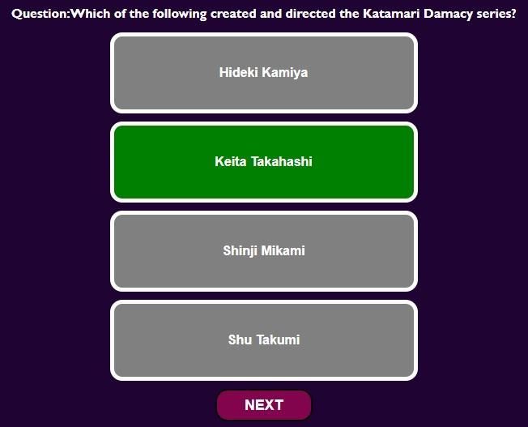

#Quiz-Lite: Milestone 2 Project

      
         

   

 
## Introduction 
Quiz-Lite is a General Trivia Quiz that utilises questions generated within the [Open Trivia Database](https://opentdb.com/). It provides users with a set questions within the general category, which encompasses all categories. The difficulty level includes all levels of difficulty. The website application is fully responsive for Desktop and mobile screens.
 

[Visit the Quiz-Lite Website](https://mhickey2-quizlite-nbv0bohfrie.ws-eu47.gitpod.io/)  
     

[Visit the Quiz-Lite Repository](https://github.com/MHickey2/Quiz-Lite)  
     

# Table of Contents 

1. [UX Strategy](#uxstrategy)
    1. [Business Goals](#businessgoals)
    2. [Target Customer](#targetcustomer)
2. [User Stories](#userstories)
    1. [First Time User](#firsttimeuser)
    2. [Regular User](#regularuser)
    3. [Site Owner](#siteowner)
3.  [Design](#design)
    1. [Wireframes](#wireframes)
    2. [Colour Scheme](#colourscheme)
    3. [Fonts](#fonts)
    4. [Icons](#icons)
    5. [Structure](#structure)
    6. [Final Webpages](#webpages)
4.  [Features](#features)
    1. [Index Page](#indexpage)    
5.  [Future](#future)
6.  [Tools and Technology](#Technology)
7.  [Testing Information](TEST.md)
8.  [Bugs and Issues](#bugs)
    1. [Resolved](#resolved)
    2. [Unresolved](#unresolved)
9.  [Deployment](#deployment)
    1. [Repository](#githubrepository)
    2. [Deploy the Site](#deployingsite)
    3. [Run Project locally](#runlocally)
    4. [Make Local Clone](#clone)
    5. [Fork GitHub Repository](#fork)
    6. [Student Template](#studenttemplate)
    7. [Custom 404 Page](#404page)
10.  [Credits](#credits)
11.  [Acknowledgements](#acknowledgements)

----

## UX Strategy 
The website was designed to provide a quick general knowledge Trivia Game. The website utilizes another site to provide the subject matter and functionality has been added to allow users to take the quiz, test their knowledge, try to get a good score. The goal is to provide an entertaining challenge and overtime the user can try to improve their mind and build their trivia knowledge. The challenge was to build a site while also encompassing a third party database to provide a greater range for user questions.
  

### The Business Goals of the Website: 
- No commercial goals, but the site's goal is to to provide entertainment and build the knowledge base of the users.
    

### The Target Customer: 
- The audience of the site would encompass a number of age groups and there would generally not be any limitation on who could avail of the quiz.
- Would probably require some access to digital technology.
- May be useful for user who has spare time and who would like to test themselves with no judgement.

    

 #### [Return to Table of Contents](#toc)
----
## User Stories  
### As a first time user to this site, I want to …..
- Understand what the website is offering.
- Enter a username and be welcomed to the site.
- Play the Quiz.
- See the number of questions to be answered.
- See the topic of the question to be asked.
- Know the difficulty level of each question.
- Know whether I get the right answer to each question.
- Find out what is the correct answer if i guessed it wrong.
- See a running total of my correct answers.
- At the end of the Quiz I would like some eedback and know what my overall score is.
- If I want to restart a Game, I want to be able to do this easily.

   

### As a regular user of the site, I want to …...    
- I want to improve my scores.  
- I want to try different categories.  
- I want to try different levels of difficulty. 
- I want to have an opportunity to answer a larger number of questions in the quiz. 

  

### As the site owner, I want to …..    
- Add more features to the site to enhance the experience of the users.
- Provide the user with ways that they can personalize their own quizzing experience.
- Improve the social aspect, by allowing users to compare their scores with other users.
- Recognise the achievement of users by providing incentives for top scores.

     

 #### [Return to Table of Contents](#toc)
----
## Design  
 

## Wireframes 

Wireframes for Site

Wireframes for Desktop, Medium Screens and Mobile Screens.  
Wireframes were created in Figma. 

  
1. Wireframe

  

         

 

#### [Return to Table of Contents](#toc)

## Colour Scheme      

The colour scheme for the website has evolved over time and originally was dark purple, rgb(31, 3, 50) with secondary elements in pink and plum. But after researching options I was going to strip it back to a white background with colour only on secondary elements to simplify the interface and reduce distractions. Then I discovered a compromise option, where the user can decide what background they would prefer. There is a toggle switch on the top left side of the screen which allows the user to toggle between light and dark mode, there is therefore 2 different colour schemes on the site.

### Light Mode:
Plane white background, White as a background color ensures clarity and removes visual obstacles and clutter, allowing the user to focus on relevant elements and text. It also offers good contrast to aid readability and enhancethe user experience. The buttons are all uniform and are pink and stand out well from the white background.
There is little in regards to imagery, with only 2 visual elements, one representative of brainpower and the toggle image which represents day and night mode.  

### Dark Mode:  
plane purple background,Dark mode may help to decrease eye strain/dry eyes for some people who spend lots of time looking at screens. There are studies that have concluded dark mode can be more economical and uses less energy at least on mobile screens. Dark mode is good in low light environments, it can also help people with cataracts or other related visual disorders. By adding white borders around certain elements, it helps them to stand out from the darker background. The buttons and headings still have good contrast on either background.

### Colour Combination

 

  

 
 

  

 

  

## Fonts used on Site  

Merriweather was used for the main heading for the site. It has a strong presence and was available in a bold font. It was a good format to apply some styling to allow it to have a greater impace. Merriweather font was designed to be pleasant for screens and so is ideal for the user.

font-family:'Gill Sans', 'Gill Sans MT', Calibri, 'Trebuchet MS', sans-serif;
Used for the majority of the site, both for regular text and headings. Sans serif is the fallback font in case other fonts are not available. See below for example of font in use.

Shadows into Light was used to add some personalised touches to the site, used when interacting with the users 
i.e. The welcoming text and the closing message to the user when the final score is shown.This font is a neat handwriting font which adds a human element to the interface.

In relation to the color, I gave the main font the color #313131(when in light mode), it can aid in preventing eye strain and can be used in a multitude of situations. I wanted to enable good user experience throughout the site where possible.

 

  

  

 

## Icons and Favicon used on site 

I used an Icon as the brain above the heading, I did not want an overbearing image, and instead opted for a small image which gives some context to the Quiz Application. Another icon I used was the image for the day-night toggle on the left hand top of the screen. Other than that the only other icons are the social media icons in the footer element. 

 

    
  
   

       
 

## Structure     
The Application has gone through a number of transitions. Originally it was 2 pages, an introduction page and a gaming page, but it was later simplified so that only 1 page is used. The introductory section consists of an intoductory blurb, a welcome message and a start button. When the Start button is pressed the introductory blurb is hidden and the main quiz interface is shown. When the game is complete a closing message screen is shown. This way the whole website is never shown in full to the user. Additional information can be inputted with the use of a prompt screen and a couple of modals.  The site itself grew out of another site, horror-quiz which was my experimental repository, the intention initially was to create a horror quiz using my own question set but I then changed to the Fetch from an API concept. The original Repository can be [found here](https://github.com/MHickey2/Horror-Quiz) 

## Final Application Page  

 

 #### [Return to Table of Contents](#toc)
----
 
## Features  

### Index Page 

The entire application is based in 1 page, with different sections showing when needed and other hidden elements are hidden when no longer needed.      

#### Username Prompt

Although not strictly on the page, the prompt is the first interactive element on the page and is presented to the user on opening the page. The username prompt had been stricter, but did not want to impede the player from partaking in the game. The prompt is presented to the user, they can enter something in the field and this will be attributed to their username in the game and they will be presented with a welcome message. If they dont enter anything and press ok, they will be permitted to play the game. If the user presses cancel, the game will not proceed. I had put in measures to ensure this field could not be blank, but this proved restrictive and I did not want the player to not avail of the game, if they didn't enter a name. In future iterations, stricter measures would be introduced. This would include a second prompt window, as future tweaking would avail of allowing users to save their scores and this would require some identification to be valid. I had looked into personalising the prompt, and this again would be introduced in a future iteration.

 

  

  

#### Intro Section:    

The Intro Section consists of the Logo, which is a brainpower Icon and a main heading and there is also an intro to the game panel. Content is simple and to the point, it is just a quick quiz, so felt the opening should be brief.     

    

#### Light/Dark Toggle:

The original concept was that the website would be a dark colour and all elements would be conducive with this colour scheme, but as the site progressed, I wanted to strip the colour back and try a lighter theme, on further research I managed to do both. Initially there were some issues, in that I had font colours within many of the body elements, so the toggle was not as affective, but when I stripped out the colours and left the body take over that responsibility, the light and dark mode was effectively accomplished. There are still some alternative font colours but that is where I wanted these fonts to be distinguisable and they had to work with both the dark and light mode.     

    
    

#### Category and Difficulty Section:

When using the API, I wanted to introduce more interactivity and allow the user to search for questios based on their requirements. Initially these options would have been on the first page and based on their input they would be presented with the result of their chosen criteria. When the change was made to have one page, I devised these options would be available in modals. Each modal has radio buttons and the values would be used as literal strings in the fetch request. There have been issues integrating user input into the fetch request. The fetch request does have default settings and will, despite this fetch generic options and generic difficulty levels, so if these options can't be utilised in this iteration, the hope is to fix this issue and allow users more control over the quiz options in the future. These options are now optional, but will be removed if issue is not resolved (See bugs). Images below.  

  

    
    

#### Start Button:

The Start Button is the last element on the initial screen view (besides the footer, which will relocate when button is pressed) and it will when pressed show the full game interface, and it will also remove any unnecessary elements. The Introductory section and option buttons will be removed, but the welcome text will remain. 

    

### The Game Interface:

This will consist of a panel with the difficulty and category panel with information on each question asked and a question number which will help the user understand their progress level in the game and the required number of questions to be asked.  

    

### Answer Section and Next Button:

The answers will be displayed in a series of buttons. When the right button is selected, it will turn green and if the selection is incorrect it will turn red. The next Button allows the user to chose the next question. Initially there was going to be a timer for the quiz, but this has since been removed, so there presently is no constraint on the time taken in the quiz. The next button allows the user time to ponder each question.  

    

### End Section:

There is a verification answer panel, which shows the user the correct answer for each question. There is also a running total of correct and incorrect scores. When the game has completed its cycle, an alert button is displayed to the user.  

    

### Closing Message and Restart Button

When the game is over, the verification answer panel will be hidden and a closing message panel will be shown. This will show the final Score to the user, and a parting comment on how well they did on the Quiz. If the user wants to repeat the game, they can do this by pressing the Restart Button, which will refresh the game and they will be presented with the opening page again, where they have option to repeat the opening process.  

  

 

#### User Experience related to common elements on each page

#### [Return to Table of Contents](#toc)
----

 

## Future   

There were a number of features that were trialed within this application and they would be included in future iterations including:

- A more rebust functionality for requesting usernames that will ensure a username would need to be supplied by the user, this would be important when user scores could be saved at the end of the game and could be a good way to introduce a level of competition with other quiz players on the site.
- An extra level of complexity, would be to add a timer element, where the game would end after a certain level of time has been surpassed.
- I had intended to introduce sound, when there was a correct and incorrect answer, but I didn't in the end, but may add a celebratory tone, when a high score is achieved at the end of a game.
- I would probably allow users to choose the number of questions they want to answer, and this would involve changing the final messages to accomodate different the starting question sets. Maybe introduce a percentile instead of a number count, as this could be utilised according to the different question load.
- At the moment session storage is being used, but with introducing scores, it would open up needs for long term storage. Competitors could test their scores, against existing high scorers, and different challenges could encourage more complexity.
- In relation to interactivity, there could be an element of social interactivity. Present social media sites could be used to encourage fellow competitors to communicate within these channels, or a dedicated forum on the site itself could be a great platform.

#### [Return to Table of Contents](#toc)
----
## Tools and Technologies Used 

- Programming Languages: &nbsp;	[HTML5](https://en.wikipedia.org/wiki/HTML5)	&nbsp; [CSS3](https://en.wikipedia.org/wiki/CSS)
  
- IDE - Editor:	&nbsp;  [Gitpod](https://gitpod.io/)
  
- Deployment:		&nbsp;	[Gitpod](https://gitpod.io/)

- Fonts:			&nbsp;    [Google Fonts](https://fonts.google.com/)

- Wireframes:  &nbsp;   [Figma](https://www.figma.com/)
  
- Testing    &nbsp;     [Chrome Developer Tools](https://developer.chrome.com/docs/devtools/)
             &nbsp;     [Js Hint](https://jshint.com/)
  
- Social Media Icons:	&nbsp;	  [Font Awesome](https://fontawesome.com/)
  
- Multimedia:		&nbsp;  Sourced from [YouTube](https://www.youtube.com/)

- Free Images:		&nbsp;    [Pixalbay](https://pixabay.com/)
  
- Image Converter:  &nbsp;      [Convertio](https://convertio.co/)

- Image Compression:  &nbsp;    [tinyPNG](https://tinyjpg.com/) 

- Grammar and spelling: &nbsp; [Grammarly](https://app.grammarly.com/) 

- Favicon Generator: &nbsp; [The Favicon Generator](https://www.ionos.com/tools/favicon-generator)

  
 

 #### [Return to Table of Contents](#toc)
----
## Deployment  

The Website was developed within Gitpod and was pushed to GitHub using the git commands:
Git add .	Which added all files

Git commit -m “Various Messages”   which commited these files and the message indicated what these files related to i.e “Working on styling for the Navigation”

Git push	Which pushed these files into the GitHub Repository.    

### Create a GitHub Repository for your site  
1. Use the drop-down menu on the upper far rigt corner of your page and select New Repository.
2. You will be presented with form for input, you can select who owns the repository and can give the repository a name. At this point you can add a description.
3. You can choose the visibility of the site, in this case public was chosen.
4. You can then initialize the site with a README.
5. You can now click the create repository button.
      

### To initially deploy this site from the Repository to GitHub pages 
1. Log into your GitHub account.
2. Choose the repository that contains your intended site, in this case.
3. Choose the Settings options.
4. Scroll down to the GitHub Pages section. 
5. You will see a Source dropdown Menu you can chose "main", and then "Save", it took a while for the Site to be published, but you will be told when it has been published and will be shown the link to the live site.  
   

### How to run the project Locally 
1. You can add a browser extension for gitpod onto your browser, in this case chrome. Also available in Firefox (add-ons). On chrome you use 3 dots on right hand corner of your screen, choose extensions, and again using hamburger menu chose to go to chrome webstore and search for gitpod and your result will be displayed. You will need to authorize permission and it will be added to Chrome.
2. Navigate to your GitHub Repository, there will be a green Gitpod button available now, you can use this and your code will be used to build a workspace which you can use to work locally.
3. The first time you do this, you need to login with GitHub so click to authorize.
4. Within the Code Institute website there is a GitPod button which will allow you to access your workspaces dashboard or you can use a shortcut on your computer to allow you to access these workspaces independently.
      

### How to make a local Clone 
1. Navigate to the main page of the repository.
2. Click the green Code Button at top right of the repository.
3. Copy the url for the repository.
4. Open Git Bash and Change the current working directory to where you want the cloned directory.
5. Type git clone, and then paste the URL you previously copied using $ git clone. 
6. Pressing enter will then create your clone.  
    

### How to fork a GitHub Repository 
1. Log into GitHub and go to the required Repository.
2. The Fork button is found at the top right corner of the page.
3. When you click this button you will have a copy of the repository in your own GitHub account.  
   

### GitHub Student Template 
This Template has been provided by the Code Institute and includes a number of tools to make life easier and has been used within this present site.    
   

### Creating a custom 404 page for your GitHub Pages Site 
1. Navigate to the site repository.
2. Using the 'add file' dropdown, choose 'Create new File'.
3. In the presented filed name, type 404.html/404.md. In my case I chose 404.html.
4. You can then add a meaningful message that describe the changes you made.
5. You can add the commit to current branch or new branch. I chose to commit to main branch and clicked to propose the new file. There were no links on the present application so did not include a 404 page.   
   

More information is available at [https://docs.github.com/en](https://docs.github.com/en), in regards to GitHub and is a great reference point for all GitHub queries.

 #### [Return to Table of Contents](#toc)
----
## Testing <a name="TEST.md">

[SEE TESTING on TEST.md Page](TEST.md)

----

## Bugs and Issues 

   

### Resolved Issues   

 

### Unresolved Issues  

The username prompt is a temporary measure, and the hope is to introduce a more customised Responsive and Accesable (WAI-ARIA) replacement for Javascript's pop-up windows. I had experimented with this [site](https://sweetalert2.github.io/#input-types) in regards to the username prompt and category and difficulty modules, but would have involved an updated version of javascript and was wary of introducing a new version, as it could have caused issues with existing elements. This site would be worth exploring for all future projects.

 

#### [Return to Table of Contents](#toc)
----
## Credit  

### Content of the site

I used the documentation and template provided by the Code Institute to provide the structure of the README file and referred to the GitHub documention as the basis of my Deployment section.

### Media

- [Trivia API](https://www.youtube.com/watch?v=SgJ_femmsfg)
- [Build a Quix App with JavScript](https://www.youtube.com/watch?v=riDzcEQbX6k)
- [How to make a Quiz App](https://www.youtube.com/watch?v=f4fB9Xg2JEY&t=3120s)
- [Build a Quiz App](https://www.youtube.com/watch?v=rFWbAj40JrQ&t=6s)
- [Create a Multiple Choice Quiz](https://www.youtube.com/watch?v=49pYIMygIcU&t=2137s)
- [Building a Multiple Choice Quiz](https://www.youtube.com/watch?v=LQGTb112N_c&t=320s)

### Code

### Sources
Sites that I have consulted when there was issues with the site: 
- [W3Schools](https://www.w3schools.com/html/html5_svg.asp)
- [https://stackoverflow.com/](https://stackoverflow.com/)

----
## Acknowledgements 
Thank you to the staff of the Code Institute for their support.

----

  

