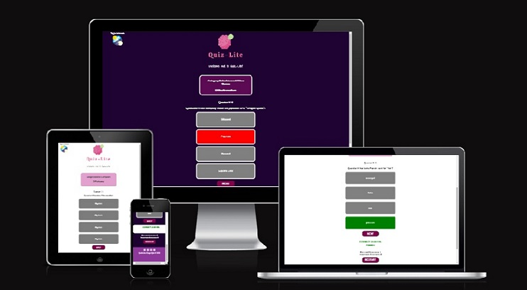
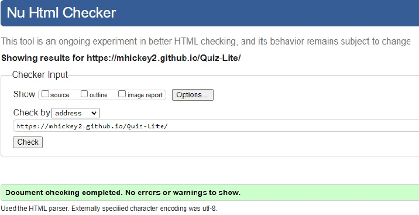
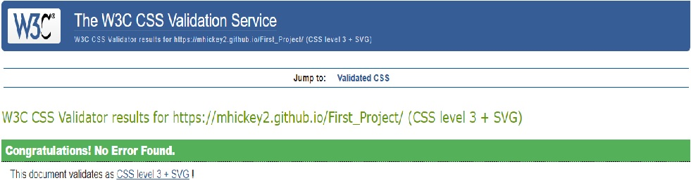
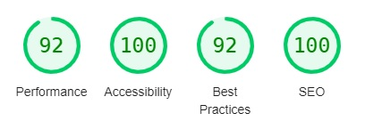
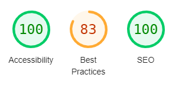
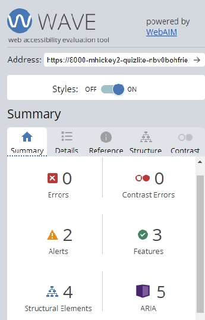
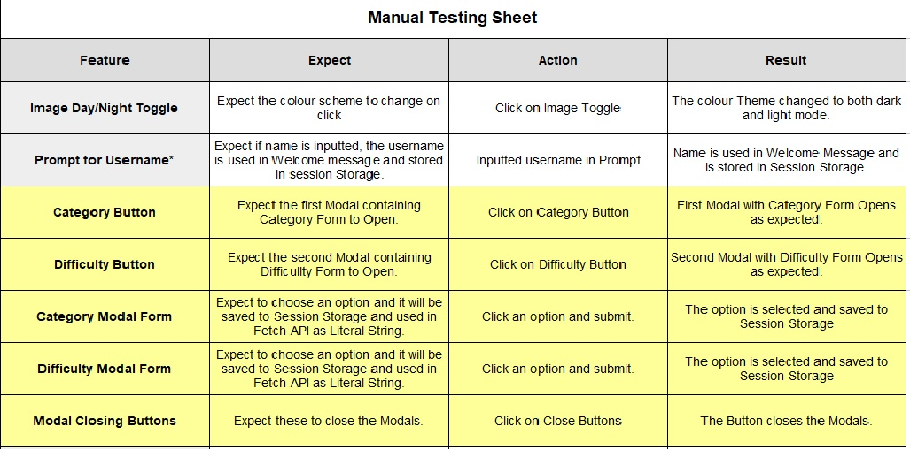
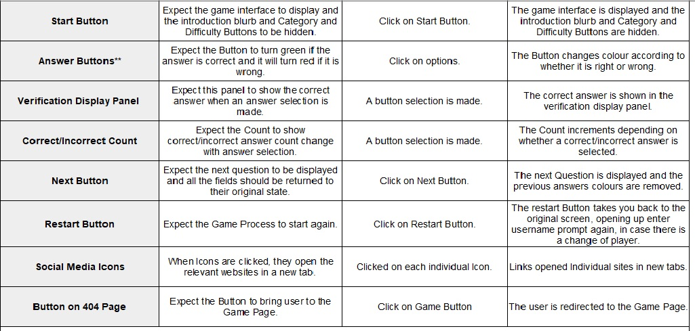

# Quiz-Lite Testing

# Table of Contents 
1.  [Cross Browser Testing](#browsertesting)
2.  [Responsive Testing](#responsivetesting)
3.  [Validator Testing](#validatortesting)
     1. [W3C Validator](#w3c)
     2. [CSS Validator](#css)
     3. [JSHint](#jshint)
     4. [Lighthouse](#lighthouse)
     5. [Contrast Checker](#contrastchecker)
     6. [WAVE](#wave)
4.  [Manual Testing](#manualtesting)
5. [User Story Testing](#userstorytesting)  

#### [Return to README.md](README.md)
----

## Browser Testing

  The site was tested in Google Chrome, Microsoft Edge, Mozilla Firefox and Brave Browser on the Desktop.
  The site was tested on a Lenovo Laptop, an Acer Aspire Netbook and older iphone5(limited functionality).  

  Appearance and Functionality appeared consistent in all browsers on the Desktop, but on the older iPhone5
  the WebP images could not be seen, on this older model, Safari does not support these images but in September 2020 onward, WebP support was added in Safari version 14. I have been testing on simulated versions online, but it hard to gauge without an actual working model. 
 

#### [Return to Table of Contents](#toc)

----
## Responsive Testing

   I regularly tested the responsiveness of the site using Google Chrome Developer tools, information on this can be found [here](https://developer.chrome.com/docs/devtools/). I also used Window Resizer and a Responsive Design Tester Application available in the Google Chrome Store. The devices I tested for are in the image below. As I was focusing on grasping the javascript I kept the elements fairly centred on the page and that could be easily adapted for all screens. So used minimal media queries and used rem for fonts and did not use many images, so as to keep the interface as simple as possible. The main work was on adapting the size of elements for the smaller screens. 

     
   
   I also used [https://ui.dev/amiresponsive](https://ui.dev/amiresponsive) and it was a useful way to see how the site was progressing in regards to reponding to different screen sizes. The image showing responsiveness can be seen below.

    
   
      
        
   

    

   Should be responsive down to 320px screen, but any smaller and there will be issues. The website is not responsive for the Galaxy Fold, but this is not within my current scope anyway. The only mobile I had access to was the iphone5, and is limited in it's capabilities, so used simulators to test the application. I used Developer tools and was working with all screen sizes.

   The Media Query Breakpoints I used were:
   - 600px width and below;
   - 350px width and below;
  
 

#### [Return to Table of Contents](#toc)

----
# Validator Testing

- W3C Validator 

Using [https://validator.w3.org/](https://validator.w3.org/)  The main issues that came up were in relations to using various headings to display information from the API. I changed these elements and it worked out the issues. There were also some empty headings, were content alone was being displayed, and these were changed to spans. There are more issues in the Bug section in the [README.md](README.md). The results of the HTML validation can be seen below:

 

      
        

   
  
- Jigsaw CSS Validator   

Using [https://jigsaw.w3.org/css-validator/](https://jigsaw.w3.org/css-validator/) 

 

      
        

 

- JSHint   

 

      
        

 

- Lighthouse  

Used the Lighthouse Testing in Google Developer Tools, lighthouse testing is also picking up issues from the console log, which is affecting the overall score. The questionnumber begins at 1 and until the game starts there is no lenght for the questions array so line 246 in script.js tests for this, but when the quiz starts this anomoly is fixed, but it picks it up in Lighthouse, hence the best practises score is effected. Also in mobile screens it expects bigger images although the size displayed is the actual size. Could have gone smalled with toggle but didn't want it to be missed for people with visual conditions.

See image below for Lighthouse scores for all pages in Desktop and Mobile.  

 

      
        

 

      
        

  - Contrast Checker  
  
  Using [https://color.a11y.com/](https://color.a11y.com/)  There was a couple of issues initially, with colour and font on buttons, but tested other colours and changed font size and it passed contrast checks. See images Below.

 
  
      
        
  

  
  

- Wave (Web Accesability Evaluation tool)   
  
  WAVE is a web accesability tool developed by WebAIM.org. It provides visual feedback about the accessibility of your web content, it highlights any errors and gives you possible suggestions for improvements. This score tends to fluctuate, it is now showing errors in that it believes answer buttons are empty, they are not as they are showing the individual answers, in the future I may add characters or numbers, but they don't really add anything to the game in the current iteration.

   
  
      
        
  

  
#### [Return to Table of Contents](#toc)

----
## Manual Testing

The Following table, shows the manual tests that were done within the site. The include details for the now defunct modals for category and difficuty, but I did refer to them in bugs, and testing was done earlier and I thought they should be included.

 

      
     

      
     

 

### Notes on Manual Testing:

* The Prompt has been removed and instead username is requested on the intro screen, the username request form is working correctly and the input button is passing the username to the welcome message and is being stored in session storage.

* The coloured boxes contain the testing that was done for features no longer within the scope of the project. But they have been included throughout the project and they were subject to a lot of testing, therefore for future iterations, I hope to build on the work carried out throughout this project to inject more control for the user on what categories are shown and which difficulty level they want to achieve.  Building on from this, the number of questions would also be chosen by the user in future applications.

* Answer Buttons although working alright, there is an issue in that you can press other answers as well as your selected choice and your score will be affected by these additional selections, more information on this issue can be found in the unresolved issues in the README.md.

 

#### [Return to Table of Contents](#toc)

----

## User Story Testing

  

## As a first time user to the site

- Understand what the website is offering.

The application has an intro blurb, which explains what the quiz is and invites the player to try it.

- Enter a username and be welcomed to the site.

The user is requested to enter a username, and this is used to welcome them to the site. Even if they do not enter a username they can play the game as an anonymous player, they will still be welcomed to the game.

- Play the Quiz.

The user can play the game, regardless of username submission.

- See the number of questions to be answered.

When they play start in the game, they will see they are viewing the 1st question of a maximum of 10 questions.

- See the topic of the question to be asked.
- Know the difficulty level of each question.

There is a category and difficulty information panel which has information on difficulty on category for each individual question.

- Know whether I get the right answer to each question.

When the user choses an option, the button will turn green if correct, and red if wrong. 

- Find out what is the correct answer if i guessed it wrong.

There is a verification Panel below the answers and this will supply the user with the correct answer everytime. this also helps people who have problems with colour vision to see the wording of the correct answer.

- See a running total of my correct answers.

There is a Tally under the answers, keeping check on the right and wrong answer count.

- At the end of the Quiz I would like some feedback and know what my overall score is.

When the game is over, an alert is shown telling the user, the game is over and there will be a closing message under the game, with their final score and an accompanying message.

- If I want to restart a Game, I want to be able to do this easily.

The Restart button is shown below the closing message, and the user will be able to repeat the game.

## As a regular user of the site

- I want to improve my scores. 
- I want to try different categories.  
- I want to try different levels of difficulty. 
- I want to have an opportunity to answer a larger number of questions in the quiz.

With modifications in future iterations, there will be opportunities to expand the capacity of the application to build complexity in the game and provide a range of difficulty and category levels. The game can also provide a bigger pool of quiz questions.

## As the site owner

- Add more features to the site to enhance the experience of the users.
- Provide the user with ways that they can personalize their own quizzing experience.

With modifications in future iterations, there will be opportunities to expand the capacity of the application to build complexity in the game and provide a range of difficulty and category levels. 

- Improve the social aspect, by allowing users to compare their scores with other users.

There are hopes to introduce a social element to the game with the use of social media and possibly the addition of a social platform within the site itself.

- Recognise the achievement of users by providing incentives for top scores.

There may opportunities for users to create their own avator to personalise their gaming experience further. With the inclusion of names and stored scores, a leaderboard could be created to keep track of high scorers.

 

#### [Return to Table of Contents](#toc)
#### [Return to README.md](README.md)

----