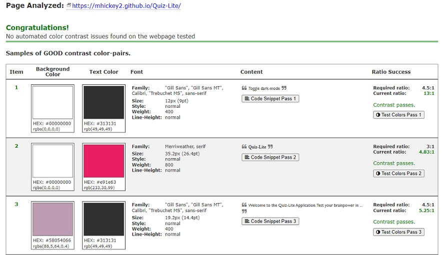

# Quiz-Lite Testing

# Table of Contents 
1.  [Cross Browser Testing](#browsertesting)
2.  [Responsive Testing](#responsivetesting)
3.  [Validator Testing](#validatortesting)
     1. [W3C Validator](#w3c)
     2. [CSS Validator](#css)
     3. [Lighthouse](#lighthouse)
     4. [Contrast Checker](#contrastchecker)
     5. [WAVE](#wave)
4.  [Manual Testing](#manualtesting)
5. [User Story Testing](#userstorytesting)  

#### [Return to README.md](README.md)
----

## Browser Testing

  The site was tested in Google Chrome, Microsoft Edge, Mozilla Firefox and Brave Browser on the Desktop.
  The site was tested on a Lenovo Laptop, an Acer Aspire Netbook and older iphone5(limited functionality).  

  Appearance and Functionality appeared consistent in all browsers on the Desktop, but on the older iPhone5
  the WebP images could not be seen, on this older model, Safari does not support these images but in September 2020 onward, WebP support was added in Safari version 14. I have been testing on simulated versions online, but it hard to gauge on an actual working model. 
 

#### [Return to Table of Contents](#toc)

----
## Responsive Testing

   I regularly tested the responsiveness of the site using Google Chrome Developer tools, information on this can be found [here](https://developer.chrome.com/docs/devtools/). I also used Window Resizer and a Responsive Design Tester Application available in the Google Chrome Store. The devices I tested for are in the image below. As I was focusing on grasping the javascript I kept the elements fairly centred on the page and that could be easily adapted for all screens. So used minimal media queries and used rem for fonts and did not use many images, so as to keep the interface as simple as possible. The main work was on adapting the size of elements for the smaller screens. 

    
   
      
          
   

   
   
   I also used [https://ui.dev/amiresponsive](https://ui.dev/amiresponsive) and it was a useful way to see how the site was progressing in regards to reponding to different screen sizes. The image showing responsiveness can be seen below.

    
   
      
        
   

    

   Should be responsive down to 320px screen, but any smaller and there will be issues. In regard to bigger screens it should be good to ?px. The website is not responsive for the Galaxy Fold, but this is not within my current scope anyway.

   The Media Query Breakpoints I used were:
   - 600px width and below;
  
 

#### [Return to Table of Contents](#toc)

----
# Validator Testing

- W3C Validator 

Using [https://validator.w3.org/](https://validator.w3.org/)  The main issues that came up were in relations to using various headings to display information from the API. I changed these elements to 

 and it worked out the issues. There were also some empty headings, were content alone was being displayed, and these were changed to spans. There are more issues in the Bug section in the [README.md](README.md). The results of the HTML validation can be seen below:

 

      
        

   
  
- Jigsaw CSS Validator   

Using [https://jigsaw.w3.org/css-validator/](https://jigsaw.w3.org/css-validator/) 

 

      
        

 

- Lighthouse  

Used the Lighthouse Testing in Google Developer Tools and the plan was to share screenshots, but have been having issues getting accurate scores from the site. The lighthouse is also picking up issues from the console log, which is affecting the overall score. 

See image below for Lighthouse scores for all pages in Desktop and Mobile.  

 

      
        

  - Contrast Checker  
  
  Using [https://color.a11y.com/](https://color.a11y.com/)  There was a couple of issues initially, with colour and font on buttons, but tested other colours and changed font size and it passed contrast checks. See images Below.

 
  
      
        
  

  
  

- Wave (Web Accesability Evaluation tool)   
  
  WAVE is a web accesability tool developed by WebAIM.org. It provides visual feedback about the accessibility of your web content, it highlights any errors and gives you possible suggestions for improvements. 

   
  
      
        
  

  
#### [Return to Table of Contents](#toc)

----
## Manual Testing

The Following table, shows the manual tests that were done within the site and refers to all the same elements on each page.

 

      
     

      
     

 

    
      
 

 

      
     

 

#### [Return to Table of Contents](#toc)

----

## User Story Testing

  

## As a first time user to the site

- Understand what the website is offering.
- Enter a username and be welcomed to the site.
- Play the Quiz.
- See the number of questions to be answered.
- See the topic of the question to be asked.
- Know the difficulty level of each question.
- Know whether I get the right answer to each question.
- Find out what is the correct answer if i guessed it wrong.
- See a running total of my correct answers.
- At the end of the Quiz I would like some eedback and know what my overall score is.
- If I want to restart a Game, I want to be able to do this easily.

## As a regular user of the site

- I want to improve my scores.  
- I want to try different categories.  
- I want to try different levels of difficulty. 
- I want to have an opportunity to answer a larger number of questions in the quiz. 

## As the site owner

- Add more features to the site to enhance the experience of the users.
- Provide the user with ways that they can personalize their own quizzing experience.
- Improve the social aspect, by allowing users to compare their scores with other users.
- Recognise the achievement of users by providing incentives for top scores.

 

#### [Return to Table of Contents](#toc)
#### [Return to README.md](README.md)

----